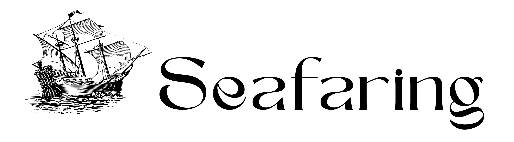
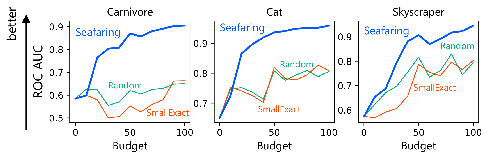
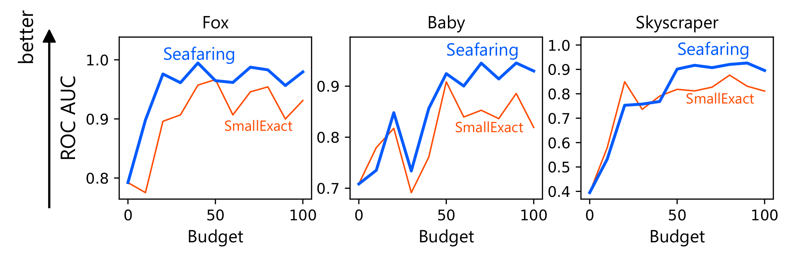

# Active Learning from the Web (WWW 2023)

<p align="center">
  
</p>

We propose Seafaring, a method for acquiring useful data for training machine learning models by regarding the myriad data on the Web as a huge pool of active learning.

Paper: https://arxiv.org/abs/2210.08205

## 💿 Dependency

Please install

* `wget` and `unzip`, e.g., by `sudo apt install wget unzip`,
* [PyTorch](https://pytorch.org/) from the [official website](https://pytorch.org/), and
* other dependencies by `pip install -r requirements.txt`.

## 📂 Files

* `download_and_preprocess.sh` downloads and preprocesses the Open Image dataset.
* `main.py` runs Seafaring and baseline methods.
* `methods.py` implements Seafaring and baseline methods.
* `tiara.py` implements Tiara, i.e., the backbone algorithm of Seafaring.
* `utils.py` implements miscellaneous functions, i.e., the word embbeding loader. 

## 🗃️ Download and Preprocess Datasets

```
$ bash ./download_and_preprocess.sh
```

Note that it may take several hours to days.

## 🧪 Evaluation

Try with Open Image datasets by

```
$ python main.py --device cuda --initdata 1 --nround 100 --budget_per_round 1 --method Random --env OpenImage --tiara_budget 1000 --poslabels Carnivore --seed 0
$ python main.py --device cuda --initdata 1 --nround 100 --budget_per_round 1 --method SmallExact --env OpenImage --tiara_budget 1000 --poslabels Carnivore --seed 0
$ python main.py --device cuda --initdata 1 --nround 100 --budget_per_round 1 --method Seafaring --env OpenImage --tiara_budget 1000 --poslabels Carnivore --seed 
```

Try with Flickr by

```
$ python main.py --device cuda --initdata 1 --nround 100 --budget_per_round 1 --method SmallExact --env Flickr --tiara_budget 100 --apikey [YOUR_API_KEY] --initialtags flickr_objects/initial_tags.txt --user 0 --threshold 0.78
$ python main.py --device cuda --initdata 1 --nround 100 --budget_per_round 1 --method Seafaring --env Flickr --tiara_budget 100 --apikey [YOUR_API_KEY] --initialtags flickr_objects/initial_tags.txt --user 0 --threshold 0.78
```

The results are saved in `results` directiory.

Please refer to the help command for further options.

```
$ python main.py -h
usage: main.py [-h] [--seed SEED] [--method {Seafaring,Random,SmallExact}]
               [--env {OpenImage,Flickr}] [--apikey APIKEY]
               [--tiara_budget TIARA_BUDGET]
               [--budget_per_round BUDGET_PER_ROUND] [--initdata INITDATA]
               [--testdata TESTDATA] [--nround NROUND] [--nepoch NEPOCH]
               [--alpha ALPHA] [--threshold THRESHOLD] [--batchsize BATCHSIZE]
               [--poolsize POOLSIZE] [--device DEVICE]
               [--poslabels POSLABELS [POSLABELS ...]] [--user USER]
               [--initialtags INITIALTAGS] [--resdir RESDIR]

optional arguments:
  -h, --help            show this help message and exit
  --seed SEED
  --method {Seafaring,Random,SmallExact}
  --env {OpenImage,Flickr}
  --apikey APIKEY       API key of Flickr. Valid only for Flickr env.
  --tiara_budget TIARA_BUDGET
  --budget_per_round BUDGET_PER_ROUND
  --initdata INITDATA   NumSizeber of the initial labelled data.
  --testdata TESTDATA   Size of the test dataset.
  --nround NROUND       Number of rounds of active learning.
  --nepoch NEPOCH       Number of epochs for training the target model.
  --alpha ALPHA         The alpha parameter of Tiara.
  --threshold THRESHOLD
                        Thoreshold of Positive data. Valid only for Flickr
                        env.
  --batchsize BATCHSIZE
  --poolsize POOLSIZE   Size of the poolsize for SmallExact method
  --device DEVICE
  --poslabels POSLABELS [POSLABELS ...]
                        List of positive labels. Valid only for OpenImage env.
  --user USER           Id of the target virtual user, i.e., category. Valid
                        only for Flickr env. See also create_virtual_users.py.
  --initialtags INITIALTAGS
                        Path to the tag file.
  --resdir RESDIR
```

### Flickr API

The Flickr experiments require a Flickr API key. Please get a key from [Flickr official website](https://www.flickr.com/services/apps/create/).

### Results



Seafaring outperforms the baseline methods in the OpenImage benchmark.



Seafaring outperforms the traditional approach of active leanring in the Flickr environment, which contains more than 10 billion images.

Please refer to the paper for more details.

## 🖋️ Citation

```
@inproceedings{sato2023active,
  author    = {Ryoma Sato},
  title     = {Active Learning from the Web},
  booktitle = {Proceedings of the Web Conference 2023, {WWW}},
  year      = {2023},
}
```